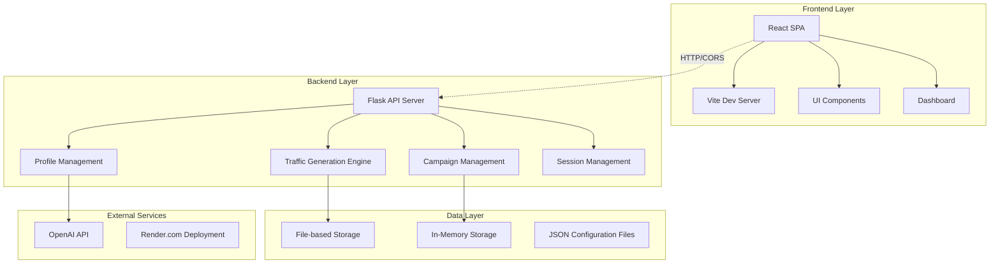
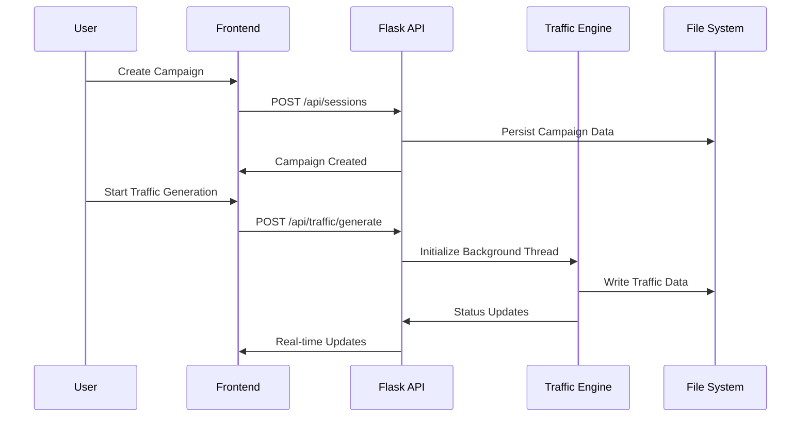

# Traffic Generator Platform - Comprehensive Project Summary

## 🎯 Project Overview
The Traffic Generator Platform is a sophisticated web application designed to simulate and generate realistic ad traffic for Real-Time Bidding (RTB) systems. It enables users to create campaigns, configure user profiles, and generate synthetic traffic data that mimics real user behavior patterns for testing and development purposes.

## 🏗️ Architecture Overview

### High-Level Architecture


### System Components

#### 🎨 Frontend (React/Vite)
- **Technology Stack**: React 18, Vite, Tailwind CSS, Radix UI
- **Architecture**: Single Page Application (SPA)
- **Key Features**:
  - Real-time dashboard with traffic monitoring
  - Campaign management interface
  - User profile configuration
  - RTB simulation controls
  - Real-time charts and analytics

#### ⚙️ Backend (Flask API)
- **Technology Stack**: Python Flask, Threading, File I/O
- **Architecture**: REST API with asynchronous traffic generation
- **Core Modules**:
  - Traffic Generation Engine
  - Campaign Management
  - User Profile System
  - Session Management
  - Logging & Monitoring

## 🛠️ Technology Stack

### Backend Technologies
| Component | Technology | Version | Purpose |
|-----------|------------|---------|---------|
| **Web Framework** | Flask | 3.0.2 | REST API server |
| **CORS Support** | Flask-CORS | 4.0.0 | Cross-origin request handling |
| **HTTP Client** | Requests | 2.31.0 | External API calls |
| **Async HTTP** | aiohttp | 3.12.12 | Asynchronous HTTP operations |
| **Authentication** | python-jose[cryptography] | 3.3.0 | JWT token handling |
| **Password Hashing** | bcrypt | 4.1.2 | Secure password storage |
| **Database ORM** | SQLAlchemy | 2.0.25 | Database abstraction (future) |
| **Migration Tool** | Alembic | 1.13.1 | Database migrations |
| **Testing** | pytest | 8.0.0 | Unit and integration testing |
| **Fake Data** | Faker | Latest | Synthetic data generation |
| **AI Integration** | OpenAI | >=1.0.0 | GPT-based referrer generation |
| **Environment** | python-dotenv | 1.0.1 | Environment variable management |

### Frontend Technologies
| Component | Technology | Purpose |
|-----------|------------|---------|
| **Framework** | React | 18.2.0 | Component-based UI |
| **Build Tool** | Vite | Latest | Fast development and building |
| **Styling** | Tailwind CSS | Latest | Utility-first CSS framework |
| **UI Components** | Radix UI | Latest | Accessible component primitives |
| **Routing** | React Router | Latest | Single page application routing |
| **Forms** | React Hook Form | Latest | Form state management |
| **Animations** | Framer Motion | Latest | Smooth animations and transitions |
| **Icons** | Lucide React | Latest | Beautiful icon library |
| **Charts** | Recharts | Latest | Data visualization |

### Deployment & Infrastructure
| Component | Technology | Purpose |
|-----------|------------|---------|
| **Cloud Platform** | Render.com | Production hosting |
| **Process Manager** | Gunicorn/Node.js | Application server |
| **Environment** | Docker-compatible | Containerized deployment |

## 🏛️ Backend Architecture Deep Dive

### 📁 Directory Structure
```
backend/
├── app/
│   ├── main.py              # Flask application entry point
│   ├── models.py            # Data models and schemas
│   └── api/                 # API endpoints
│       ├── traffic.py       # Traffic generation engine (2290 lines)
│       ├── sessions.py      # Campaign/session management
│       ├── profiles.py      # User profile management
│       ├── referrer_bank.py # Referrer URL management
│       ├── llm_referrer_bank.py # AI-powered referrer generation
│       └── logging_config.py # Centralized logging setup
├── requirements.txt         # Python dependencies
├── Procfile                # Render.com deployment config
└── API_DOCUMENTATION.md     # Comprehensive API documentation
```

### 🔄 Core Backend Modules

#### 1. Traffic Generation Engine (`traffic.py`)
**Size**: 2,290 lines - The heart of the application
**Key Features**:
- Multi-threaded traffic generation
- RTB bid request simulation
- Realistic user behavior patterns
- ADID (Advertising Identifier) management
- Traffic data persistence
- Real-time monitoring and logging

**Core Classes**:
```python
@dataclass
class TrafficConfig:
    campaign_id: str
    target_url: str
    requests_per_minute: int = 10
    duration_minutes: Optional[int] = 60
    geo_locations: List[str] = field(default_factory=lambda: ["United States"])
    rtb_config: Dict[str, Any] = field(default_factory=dict)
    user_profile_ids: List[str] = None
    profile_user_counts: Dict[str, int] = None
```

**Traffic Generation Process**:
1. **Campaign Validation**: Verify campaign status and configuration
2. **Profile Selection**: Weighted random selection based on user counts
3. **Request Generation**: Create realistic HTTP requests with proper headers
4. **RTB Simulation**: Generate OpenRTB-compatible bid requests
5. **Data Logging**: Persistent storage of traffic patterns
6. **Thread Management**: Concurrent traffic generation with proper cleanup

#### 2. Session Management (`sessions.py`)
**Purpose**: Campaign lifecycle management
**Features**:
- Campaign creation and configuration
- Status tracking (draft, running, completed, paused)
- User profile assignment
- Geographic targeting
- Duration and rate limiting

#### 3. User Profile Management (`profiles.py`)
**Purpose**: Synthetic user persona management
**Features**:
- Demographic configuration (age, gender, interests)
- Device preferences (brands, models, OS)
- App usage patterns
- RTB-specific parameters
- AI-powered referrer generation

#### 4. RTB (Real-Time Bidding) System
**Purpose**: Simulate programmatic advertising ecosystem
**Components**:
- **Bid Request Generation**: OpenRTB 2.5 compatible
- **Device Fingerprinting**: Realistic device signatures
- **User Segmentation**: Behavioral targeting simulation
- **Ad Format Support**: Banner, video, native, interstitial
- **Geo-targeting**: Location-based request simulation

### 🚀 Key Backend Features

#### Multi-threading Architecture
```python
# Thread-safe traffic generation
active_threads = {}  # Campaign ID -> Thread ID mapping
thread_locks = {}    # Per-campaign thread synchronization

def generate_traffic_background(config: TrafficConfig, thread_id: str):
    """Background traffic generation with cleanup"""
    try:
        # Thread-safe traffic simulation
        with thread_locks[config.campaign_id]:
            # Generate traffic requests
            pass
    finally:
        # Cleanup thread resources
        cleanup_thread(config.campaign_id)
```

#### Data Persistence Strategy
- **File-based Storage**: JSON files for campaign data
- **Hierarchical Organization**: `/data/traffic/campaign_id/`
- **Log Aggregation**: Centralized logging with rotation
- **Real-time Updates**: Live data streaming to frontend

#### API Design Patterns
- **RESTful Endpoints**: Standard HTTP methods and status codes
- **Blueprint Organization**: Modular route management
- **Error Handling**: Consistent error response format
- **CORS Configuration**: Multi-origin frontend support

### 🔌 API Endpoints Summary

#### Traffic Generation API
- `POST /api/traffic/generate` - Start traffic generation
- `POST /api/traffic/stop/<campaign_id>` - Stop traffic generation
- `GET /api/traffic/stats/<campaign_id>` - Get traffic statistics
- `GET /api/traffic/events-log` - Download traffic logs

#### Campaign Management API
- `GET /api/sessions/` - List all campaigns
- `POST /api/sessions/` - Create new campaign
- `GET /api/sessions/<campaign_id>` - Get campaign details
- `PUT /api/sessions/<campaign_id>` - Update campaign
- `DELETE /api/sessions/<campaign_id>` - Delete campaign

#### Profile Management API
- `GET /api/profiles/` - List user profiles
- `POST /api/profiles/` - Create user profile
- `PUT /api/profiles/<profile_id>` - Update profile
- `DELETE /api/profiles/<profile_id>` - Delete profile

## 🎮 Frontend Architecture

### Component Structure
```
src/
├── components/
│   ├── dashboard/          # Real-time monitoring
│   ├── generator/          # Traffic configuration
│   ├── campaigns/          # Campaign management
│   ├── profiles/           # User profile UI
│   └── ui/                 # Reusable UI components
├── pages/                  # Route-based pages
├── api/                    # HTTP client utilities
├── hooks/                  # Custom React hooks
└── utils/                  # Helper functions
```

### Key Frontend Features
- **Real-time Dashboard**: Live traffic monitoring with charts
- **Campaign Wizard**: Step-by-step campaign creation
- **Profile Designer**: Visual user profile configuration
- **RTB Simulator**: Real-time bidding configuration interface
- **Log Viewer**: Live traffic log streaming

## 🔒 Security & Best Practices

### Backend Security
- **CORS Configuration**: Explicit origin whitelisting
- **Input Validation**: Request data sanitization
- **Error Handling**: No sensitive data in error responses
- **Thread Safety**: Proper synchronization for concurrent operations
- **Logging**: Comprehensive audit trails

### Frontend Security
- **Environment Variables**: Secure API endpoint configuration
- **HTTPS Only**: Encrypted communication
- **XSS Prevention**: Sanitized user inputs
- **CSRF Protection**: Secure form handling

## 📊 Data Flow Architecture

### Campaign Creation Flow


### RTB Request Generation


## 🚀 Deployment Architecture

### Production Setup (Render.com)
```yaml
# render.yaml configuration
services:
  - type: web
    name: traffic-generator-backend
    env: python
    buildCommand: pip install -r requirements.txt
    startCommand: FLASK_APP=app.main flask run
    
  - type: web  
    name: traffic-generator-frontend
    env: node
    buildCommand: npm install && npm run build
    startCommand: node server.js
```

### Environment Configuration
- **Production**: Render.com with auto-scaling
- **CORS Origins**: Configurable for multiple domains
- **Logging**: Centralized log aggregation
- **Health Checks**: Automated monitoring endpoints

## 🎯 Use Cases & Applications

### Primary Use Cases
1. **Ad Tech Testing**: RTB system validation
2. **Load Testing**: Traffic simulation for performance testing
3. **Analytics Validation**: User behavior pattern testing
4. **Campaign Optimization**: A/B testing traffic scenarios
5. **Compliance Testing**: GDPR/CCPA traffic simulation

### Target Users
- **Ad Tech Engineers**: RTB system developers
- **QA Teams**: Load and functional testing
- **Data Scientists**: Synthetic data generation
- **Campaign Managers**: Traffic pattern analysis

## 📈 Performance Characteristics

### Traffic Generation Capabilities
- **Concurrent Campaigns**: Multiple simultaneous campaigns
- **Request Rate**: Configurable 1-1000 requests/minute
- **Duration**: Unlimited or time-bound campaigns
- **Profiles**: Support for complex user personas
- **Geographic**: Multi-region traffic simulation

### System Limits
- **File Size**: 10MB max campaign data files
- **Memory**: In-memory profile storage
- **Concurrency**: Thread-per-campaign model
- **Storage**: File-based persistence (scalable to DB)

## 🔮 Future Enhancements

### Planned Features
- **Database Integration**: SQLAlchemy-based persistence
- **Authentication System**: JWT-based user management
- **Advanced Analytics**: ML-powered insights
- **API Rate Limiting**: Request throttling
- **Webhook Support**: Real-time event notifications
- **Docker Containerization**: Improved deployment

### Scalability Roadmap
- **Microservices**: Service decomposition
- **Message Queues**: Async job processing
- **Caching Layer**: Redis integration
- **CDN Integration**: Global content delivery
- **Monitoring**: Comprehensive observability

## 🏁 Getting Started

### Prerequisites
- Python 3.8+
- Node.js 18+
- OpenAI API key (for AI features)

### Local Development Setup
```bash
# Backend
cd backend
pip install -r requirements.txt
export FLASK_APP=app.main
flask run

# Frontend
cd frontend
npm install
npm run dev
```

### Production Deployment
- Deployed on Render.com with automatic scaling
- Environment variables configured in Render dashboard
- HTTPS termination and custom domain support

---

This Traffic Generator Platform represents a comprehensive solution for ad tech testing and synthetic traffic generation, built with modern web technologies and designed for scalability and ease of use.